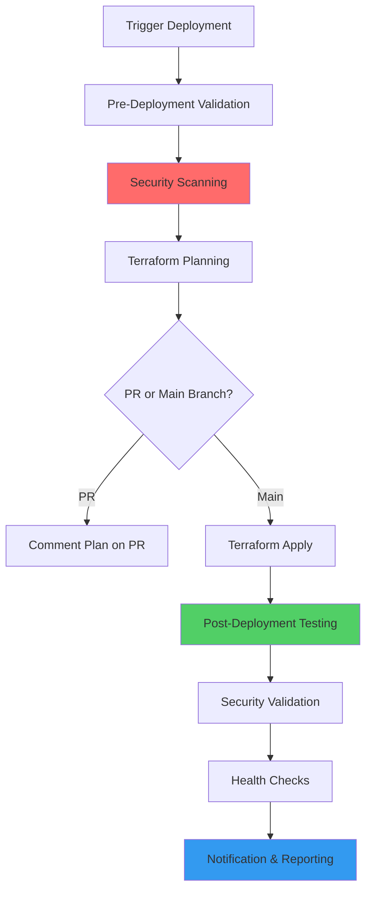

# 🚀 ZK-Vault Deployment Pipeline Guide

## Overview

This document describes the comprehensive, modular deployment pipeline for ZK-Vault built following 2025 industry best practices. The pipeline implements GitOps, Infrastructure as Code (IaC), security-first DevSecOps, and modern deployment automation.

## 🏗️ Architecture Overview

### Modular Infrastructure Design

The infrastructure is organized into discrete, reusable modules following the Single Responsibility Principle (SRP):

```
infrastructure/terraform/
├── terraform.tf          # Provider and backend configuration
├── variables.tf           # Global variables
├── main.tf               # Module orchestration
├── outputs.tf            # Aggregated outputs
└── modules/
    ├── platform/         # Foundation platform module
    ├── networking/       # Secure networking infrastructure
    ├── security/         # IAM, KMS, secrets management
    └── firebase/         # Firebase services configuration
```

### Module Responsibilities

#### 🔧 Platform Module (`modules/platform/`)
- **Purpose**: Foundation platform setup and project initialization
- **Responsibilities**:
  - GCP project configuration and API enablement
  - Basic IAM setup and service accounts
  - Workload Identity configuration
  - Cost optimization and resource quotas
  - Platform-level monitoring and logging

#### 🌐 Networking Module (`modules/networking/`)
- **Purpose**: Secure, scalable network infrastructure
- **Responsibilities**:
  - VPC creation with custom subnets
  - Firewall rules and security policies
  - NAT gateways and Cloud Router
  - Private DNS zones
  - Network security monitoring
  - DDoS protection and rate limiting

#### 🔒 Security Module (`modules/security/`)
- **Purpose**: Comprehensive security and compliance
- **Responsibilities**:
  - IAM service accounts and custom roles
  - Google Cloud KMS for encryption at rest
  - Secret Manager for sensitive data
  - Binary Authorization for container security
  - Organization policies and compliance
  - Audit logging and security monitoring
  - Data Loss Prevention (DLP) configuration

#### 🔥 Firebase Module (`modules/firebase/`)
- **Purpose**: Firebase services for the ZK-Vault application
- **Responsibilities**:
  - Firebase project configuration
  - Firebase Authentication with multiple providers
  - Firestore database setup with security rules
  - Firebase Storage with CORS configuration
  - Firebase Hosting for web application
  - Firebase Functions runtime configuration

## 🔥 Firebase Setup and Deployment

### Prerequisites for Firebase

1. **GCP Project Setup**:
   ```bash
   # Create GCP projects for each environment
   gcloud projects create zk-vault-development
   gcloud projects create zk-vault-staging  
   gcloud projects create zk-vault-production
   
   # Enable billing for all projects
   gcloud billing accounts list
   gcloud billing projects link zk-vault-development --billing-account=YOUR_BILLING_ACCOUNT
   ```

2. **Required Environment Variables**:
   ```bash
   export PROJECT_ID="zk-vault-development"  # or staging/production
   export BILLING_ACCOUNT="YOUR_BILLING_ACCOUNT_ID"
   export ORGANIZATION_ID="YOUR_ORG_ID"  # Optional
   export OAUTH_CLIENT_ID="YOUR_GOOGLE_OAUTH_CLIENT_ID"
   export OAUTH_CLIENT_SECRET="YOUR_GOOGLE_OAUTH_CLIENT_SECRET"
   ```

3. **Tool Installation**:
   ```bash
   # Install required tools
   npm install -g firebase-tools
   
   # Authenticate with GCP and Firebase
   gcloud auth login
   firebase login
   ```

### Firebase Deployment Methods

#### Method 1: Using the Deployment Script (Recommended)

The project includes a comprehensive deployment script that handles both Terraform and Firebase operations:

```bash
# Deploy to development environment
export PROJECT_ID="zk-vault-development"
./scripts/deploy-firebase.sh development

# Deploy to staging with plan-only first
export PROJECT_ID="zk-vault-staging"
./scripts/deploy-firebase.sh --plan-only staging
./scripts/deploy-firebase.sh staging

# Deploy to production (with extra confirmation)
export PROJECT_ID="zk-vault-production"
./scripts/deploy-firebase.sh production
```

**Script Options**:
- `--plan-only`: Run terraform plan only (no apply)
- `--destroy`: Destroy infrastructure (use with caution)
- `--force`: Skip confirmation prompts
- `--verbose`: Enable verbose output
- `--terraform-only`: Run only Terraform (skip Firebase CLI)
- `--firebase-only`: Run only Firebase CLI (skip Terraform)

#### Method 2: Manual Deployment Steps

1. **Initialize Terraform**:
   ```bash
   cd infrastructure/terraform
   terraform init
   ```

2. **Plan and Apply Infrastructure**:
   ```bash
   # Create terraform.tfvars
   cat > terraform.tfvars << EOF
   project_id = "zk-vault-development"
   environment = "development"
   region = "us-central1"
   oauth_client_id = "${OAUTH_CLIENT_ID}"
   oauth_client_secret = "${OAUTH_CLIENT_SECRET}"
   EOF
   
   # Plan and apply
   terraform plan -var-file="terraform.tfvars" -var-file="environments/development.tfvars"
   terraform apply
   ```

3. **Deploy Firebase Services**:
   ```bash
   # Set Firebase project
   firebase use zk-vault-development
   
   # Deploy security rules and hosting
   firebase deploy --only firestore:rules,storage:rules,hosting
   ```

### Environment-Specific Firebase Configurations

#### Development Environment
- **Firestore**: Nam5 multi-region for low latency
- **Authentication**: All providers enabled for testing
- **Security Rules**: Relaxed for development
- **Hosting**: Preview channels enabled
- **Emulators**: Full emulator suite for local development

#### Staging Environment  
- **Firestore**: Nam5 multi-region with staging data
- **Authentication**: Production-like auth flow
- **Security Rules**: Production-equivalent rules
- **Hosting**: Preview deployments for testing
- **Monitoring**: Enhanced monitoring for pre-production

#### Production Environment
- **Firestore**: Nam5 multi-region with backup
- **Authentication**: All production providers
- **Security Rules**: Strict zero-knowledge rules
- **Hosting**: CDN and global distribution
- **Monitoring**: Comprehensive monitoring and alerting

### Firebase Security Rules

The deployment includes comprehensive security rules:

#### Firestore Rules (`firestore.rules`)
- **Zero-knowledge architecture**: Users can only access their own encrypted data
- **Encrypted data validation**: Ensures proper encryption structure
- **Metadata protection**: Prevents sensitive data in metadata
- **Audit trail**: Read-only security events for users

#### Storage Rules (`storage.rules`)
- **User isolation**: Strict file access controls
- **File type validation**: Allowed file types and sizes
- **Metadata requirements**: Encryption metadata required
- **Temporary staging**: Secure upload staging area

### Firebase Configuration Files

#### `firebase.json`
```json
{
  "projects": {
    "default": "zk-vault-development",
    "development": "zk-vault-development",
    "staging": "zk-vault-staging", 
    "production": "zk-vault-production"
  },
  "hosting": {
    "public": "packages/web-app/dist",
    "headers": [
      {
        "source": "**",
        "headers": [
          {
            "key": "Content-Security-Policy",
            "value": "default-src 'self'; script-src 'self' 'unsafe-inline'..."
          }
        ]
      }
    ]
  }
}
```

#### `firestore.indexes.json`
Optimized indexes for:
- User-specific queries
- Item type filtering
- Timestamp-based sorting
- Security event queries

### Firebase Emulator Setup

For local development, use the Firebase emulator suite:

```bash
# Start all emulators
npm run dev:emulators

# Or start specific emulators
firebase emulators:start --only auth,firestore,storage
```

**Emulator Configuration**:
- **Auth**: Port 9099
- **Firestore**: Port 8080
- **Storage**: Port 9199
- **Hosting**: Port 5000
- **UI**: Port 4000

### Post-Deployment Validation

The deployment script includes automatic validation:

1. **Firebase Project Access**: Verify project accessibility
2. **Firestore Database**: Confirm database creation
3. **Security Rules**: Validate rule deployment
4. **Hosting Deployment**: Check hosting URL availability
5. **Authentication**: Verify auth configuration

### Firebase Monitoring and Alerting

The Firebase module includes monitoring for:

- **Firestore Errors**: Database operation failures
- **Storage Errors**: File operation failures  
- **Authentication Failures**: Login attempt monitoring
- **Performance**: Response time and throughput
- **Security Events**: Suspicious activity detection

## 🚀 Deployment Pipeline Features

### GitOps Workflow

The deployment pipeline follows GitOps principles with Git as the single source of truth:

- **Branch-based environments**:
  - `main` branch → Production environment
  - `develop` branch → Staging environment
  - Feature branches → Development environment

- **Pull Request workflow**:
  - Terraform plans on PR creation
  - Security and compliance scanning
  - Automated plan comments on PRs
  - Approval workflows for production

### Security-First Approach (DevSecOps)

#### Pre-Deployment Security Scanning
- **Terraform Security Scanning**: Using `tfsec` for infrastructure security
- **Policy Compliance**: Using `checkov` for policy compliance
- **Secrets Detection**: Using GitGuardian for secret scanning
- **Vulnerability Assessment**: Container and infrastructure vulnerability scanning

#### Runtime Security
- **Binary Authorization**: Container image signing and verification (production)
- **IAM Least Privilege**: Fine-grained service account permissions
- **Network Security**: VPC security controls and monitoring
- **Audit Logging**: Comprehensive audit trail for all operations

### Environment-Specific Configuration

Each environment has tailored configurations:

#### Development Environment
- **Network**: `10.0.x.x/24` subnets
- **Security**: Relaxed for development productivity
- **Resources**: Minimal for cost optimization
- **Monitoring**: Basic monitoring and alerting

#### Staging Environment
- **Network**: `10.1.x.x/24` subnets
- **Security**: Production-like security controls
- **Resources**: Moderate scaling for testing
- **Monitoring**: Enhanced monitoring for pre-production validation

#### Production Environment
- **Network**: `10.2.x.x/24` subnets with management subnet
- **Security**: Maximum security controls and compliance
- **Resources**: Auto-scaling and high availability
- **Monitoring**: Comprehensive monitoring, alerting, and observability

## 🛠️ Using the Deployment Pipeline

### Prerequisites

1. **Google Cloud Project**: Set up a GCP project with billing enabled
2. **GitHub Repository**: Set up the ZK-Vault repository
3. **Workload Identity Federation**: Configure OIDC authentication
4. **Terraform State Bucket**: Create a GCS bucket for Terraform state

### Required Secrets and Variables

#### Repository Secrets
```bash
# Google Cloud Configuration
PROJECT_ID=your-gcp-project-id
ORGANIZATION_ID=your-gcp-org-id
BILLING_ACCOUNT=your-billing-account-id
TF_STATE_BUCKET=your-terraform-state-bucket

# Workload Identity Federation
WIF_PROVIDER=projects/PROJECT_NUM/locations/global/workloadIdentityPools/POOL_ID/providers/PROVIDER_ID
WIF_SERVICE_ACCOUNT=terraform-service-account@PROJECT_ID.iam.gserviceaccount.com

# OAuth Configuration
OAUTH_CLIENT_ID=your-google-oauth-client-id
OAUTH_CLIENT_SECRET=your-google-oauth-client-secret

# Optional: Security scanning
GITGUARDIAN_API_KEY=your-gitguardian-api-key
```

#### Repository Variables
```bash
# Regional Configuration
REGION=us-central1
ZONE=us-central1-a
FIRESTORE_LOCATION=nam5
```

### Deployment Methods

#### 1. Automatic Deployment (GitOps)

Push changes to trigger automatic deployments:

```bash
# Development deployment
git push origin feature/new-feature

# Staging deployment
git push origin develop

# Production deployment
git push origin main
```

#### 2. Manual Deployment (Workflow Dispatch)

Use GitHub Actions workflow dispatch for manual control:

1. Go to Actions → "🚀 Deploy Infrastructure"
2. Click "Run workflow"
3. Select:
   - **Environment**: development/staging/production
   - **Action**: plan/apply/destroy
   - **Force Deploy**: true/false (for production safety overrides)
   - **Modules**: specific modules or leave empty for all

#### 3. Pull Request Planning

Create a PR to see Terraform plans:

```bash
git checkout -b feature/infrastructure-update
# Make changes to infrastructure/terraform/
git commit -m "Update infrastructure configuration"
git push origin feature/infrastructure-update
# Create PR → Terraform plan will be commented
```

### Deployment Process Flow



## 🔧 Customization and Extension

### Adding New Modules

1. Create module directory: `infrastructure/terraform/modules/new-module/`
2. Add module files:
   ```
   new-module/
   ├── variables.tf
   ├── main.tf
   ├── outputs.tf
   └── README.md
   ```
3. Import module in `main.tf`:
   ```hcl
   module "new_module" {
     source = "./modules/new-module"
     # ... configuration
   }
   ```

### Environment-Specific Overrides

Use environment-specific variable files:

```bash
infrastructure/terraform/environments/
├── development.tfvars
├── staging.tfvars
└── production.tfvars
```

### Custom Security Policies

Add custom organization policies in `modules/security/`:

```hcl
resource "google_org_policy_policy" "custom_policy" {
  name   = "organizations/${var.organization_id}/policies/custom.policy"
  parent = "organizations/${var.organization_id}"
  # ... policy configuration
}
```

## 📊 Monitoring and Observability

### Built-in Monitoring

- **Infrastructure Metrics**: GCP native monitoring for all resources
- **Security Alerts**: Automated alerts for security events
- **Cost Monitoring**: Budget alerts and cost optimization recommendations
- **Performance Monitoring**: Application and infrastructure performance metrics

### Custom Dashboards

The pipeline creates monitoring dashboards:

1. **Security Dashboard**: Security events and compliance status
2. **Performance Dashboard**: Application performance and resource utilization
3. **Business Dashboard**: User metrics and feature usage

### Log Aggregation

- **Audit Logs**: Centralized audit logging for compliance
- **Application Logs**: Structured logging for troubleshooting
- **Security Logs**: Security event correlation and analysis

## 🛡️ Security Best Practices

### Infrastructure Security

- **Least Privilege IAM**: Service accounts with minimal required permissions
- **Network Segmentation**: Isolated subnets for different tiers
- **Encryption**: KMS encryption for all sensitive data
- **Secret Management**: Google Secret Manager for credentials

### Deployment Security

- **Signed Commits**: Require signed commits for production deployments
- **Branch Protection**: Protected branches with required reviews
- **Security Scanning**: Automated security scanning in CI/CD
- **Approval Workflows**: Human approval for production changes

### Runtime Security

- **Binary Authorization**: Container image verification
- **Network Policies**: Firewall rules and security groups
- **Audit Logging**: Comprehensive audit trail
- **Monitoring**: Real-time security monitoring and alerting

## 💰 Cost Optimization

### Automated Cost Controls

- **Budget Alerts**: Automatic budget monitoring and alerts
- **Resource Scaling**: Environment-appropriate resource sizing
- **Cleanup Jobs**: Automatic cleanup of development resources
- **Reserved Instances**: Cost optimization recommendations

### Environment-Specific Optimization

- **Development**: Minimal resources, preemptible instances
- **Staging**: Moderate resources for testing
- **Production**: Optimized for performance and availability

## 🚨 Troubleshooting

### Common Issues

#### Terraform State Lock
```bash
# If state is locked, force unlock (use with caution)
terraform force-unlock LOCK_ID
```

#### Permission Errors
```bash
# Check service account permissions
gcloud projects get-iam-policy PROJECT_ID
```

#### Module Dependencies
```bash
# Refresh module dependencies
terraform get -update
```

### Debug Mode

Enable debug logging in workflows:

```yaml
env:
  TF_LOG: DEBUG
  GITHUB_ACTIONS_STEP_DEBUG: true
```

## 📚 Additional Resources

- [Terraform Google Provider Documentation](https://registry.terraform.io/providers/hashicorp/google/latest/docs)
- [Firebase Terraform Resources](https://registry.terraform.io/providers/hashicorp/google/latest/docs/resources/firebase_project)
- [Google Cloud Security Best Practices](https://cloud.google.com/security/best-practices)
- [GitOps Principles and Practices](https://www.gitops.tech/)

## 🤝 Contributing

When contributing to the infrastructure:

1. **Follow Module Structure**: Use the established module pattern
2. **Security First**: Always consider security implications
3. **Documentation**: Update documentation for any changes
4. **Testing**: Test changes in development environment first
5. **Code Review**: All changes require peer review

## 📞 Support

For issues with the deployment pipeline:

1. Check the workflow logs in GitHub Actions
2. Review the troubleshooting section above
3. Check Terraform plan output for configuration issues
4. Verify required secrets and variables are set correctly

This deployment pipeline provides a robust, secure, and scalable foundation for deploying ZK-Vault infrastructure following industry best practices for 2025. 