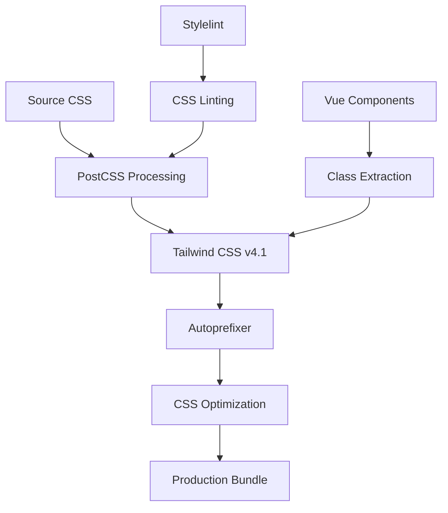

# Tailwind CSS v4.1 Build Process Documentation

## Overview

This document outlines the robust Tailwind CSS v4.1 build process implemented for the ZK-Vault web application, featuring optimized compilation, purging, linting, and runtime performance.

## Architecture

### 🏗️ Build Pipeline



### 📁 File Structure

```
src/styles/
├── index.css              # Main entry point
├── theme/
│   ├── index.css          # Theme configuration
│   ├── variables.css      # CSS custom properties
│   ├── colors.css         # Color system
│   └── ...
├── base/                  # Foundation styles
├── components/            # Component styles
├── utilities/             # Custom utilities
└── animations/            # Performance-optimized animations
```

## Configuration Files

### 1. PostCSS Configuration (`postcss.config.mjs`)

```javascript
export default {
  plugins: {
    'postcss-import': {},           // CSS @import resolution
    '@tailwindcss/postcss': {},     // Tailwind CSS v4.1 plugin
    'postcss-nested': {},           // Nested CSS support
    'postcss-preset-env': {         // Modern CSS features
      stage: 2,
      browsers: ['last 2 versions', '> 1%', 'not dead']
    },
    'autoprefixer': {},             // Vendor prefixes
    ...(process.env.NODE_ENV === 'production' && {
      'cssnano': {                  // Production optimization
        preset: ['default', {
          discardComments: { removeAll: false },
          calc: true,
          mergeRules: true
        }]
      }
    })
  }
}
```

### 2. Tailwind Configuration (`tailwind.config.js`)

Key features:
- **Content Detection**: Advanced Vue component scanning
- **CSS-First Theme**: Using `@theme` directive in CSS files
- **Performance Optimizations**: Optimized animations and transitions
- **Accessibility**: Built-in a11y considerations

### 3. Vite Integration (`vite.config.ts`)

```javascript
export default defineConfig({
  css: {
    postcss: './postcss.config.mjs',
    devSourcemap: true,
    cssCodeSplit: true,
    cssMinify: 'esbuild'
  },
  // ... other config
})
```

## Build Scripts

### Development

```bash
npm run dev                 # Start development server with HMR
npm run dev:debug          # Development with debug output
npm run dev:https          # Development with HTTPS
```

### Production

```bash
npm run build              # Production build with optimization
npm run build:analyze      # Build with bundle analysis
npm run build:profile      # Build with performance profiling
```

### CSS-Specific

```bash
npm run build:css          # Standalone CSS compilation
npm run lint:css           # CSS linting with Stylelint
```

### Quality Assurance

```bash
npm run quality:all        # Run all quality checks
npm run lint               # JavaScript/TypeScript linting
npm run lint:css           # CSS linting
npm run type-check         # TypeScript type checking
```

## Features

### 🚀 Performance Optimizations

1. **CSS Code Splitting**: Automatic chunking for better caching
2. **Tree Shaking**: Unused CSS removal in production
3. **Critical CSS**: Inline critical styles for faster rendering
4. **Asset Optimization**: Optimized file naming and caching

### 🎨 Design System Integration

1. **CSS Custom Properties**: Semantic color and spacing tokens
2. **Component Variants**: Consistent component styling
3. **Responsive Design**: Mobile-first responsive utilities
4. **Dark Mode**: Automatic dark mode support

### 🔍 Development Experience

1. **Hot Module Replacement**: Instant CSS updates
2. **Source Maps**: Debugging support in development
3. **Linting**: Comprehensive CSS linting with Stylelint
4. **IntelliSense**: Full IDE support for Tailwind classes

### ♿ Accessibility

1. **Reduced Motion**: Respects user motion preferences
2. **Color Contrast**: WCAG-compliant color combinations
3. **Focus Management**: Proper focus indicators
4. **Screen Reader**: Semantic HTML structure

## Content Purging

### Automatic Detection

The build process automatically scans:
- Vue single-file components (`.vue`)
- TypeScript/JavaScript files (`.ts`, `.js`)
- HTML templates
- Shared package components

### Custom Extraction

```javascript
// tailwind.config.js
content: {
  extract: {
    vue: (content) => {
      // Custom Vue component class extraction
      // Handles dynamic classes and computed properties
    }
  }
}
```

## CSS Architecture

### Layer Organization

```css
@layer base {
  /* Foundational styles, resets */
}

@layer components {
  /* Component-specific styles */
}

@layer utilities {
  /* Utility classes and overrides */
}
```

### Component Patterns

```css
/* Component-scoped styles */
.password-item {
  @apply relative flex items-center p-4 rounded-lg border;
  
  /* Custom properties for dynamic values */
  --strength-color: theme('colors.gray.400');
  
  /* Performance optimizations */
  contain: layout style paint;
  content-visibility: auto;
}
```

## Browser Support

- **Modern Browsers**: Chrome 90+, Firefox 88+, Safari 14+, Edge 90+
- **CSS Features**: CSS Grid, Flexbox, Custom Properties, Container Queries
- **Fallbacks**: Graceful degradation for older browsers

## Performance Metrics

### Build Performance
- **Development**: ~200ms CSS compilation
- **Production**: ~2s full optimization
- **Bundle Size**: ~50KB gzipped CSS

### Runtime Performance
- **First Paint**: Optimized critical CSS
- **Layout Stability**: No CLS from CSS loading
- **Animation Performance**: 60fps animations

## Troubleshooting

### Common Issues

1. **CSS Not Loading**
   ```bash
   # Check PostCSS configuration
   npm run build:css
   ```

2. **Classes Not Purged**
   ```bash
   # Verify content configuration
   npm run build:analyze
   ```

3. **Linting Errors**
   ```bash
   # Fix CSS linting issues
   npm run lint:css --fix
   ```

### Debug Commands

```bash
# Verbose build output
DEBUG=vite:css npm run build

# PostCSS debug
DEBUG=postcss npm run dev

# Tailwind debug
TAILWIND_DEBUG=1 npm run build
```

## Migration Notes

### From v3 to v4.1

1. **Configuration**: Moved from JS to CSS-first approach
2. **Plugins**: Updated to v4.1 compatible versions
3. **Content**: Enhanced content detection
4. **Performance**: Improved build times and bundle sizes

### Breaking Changes

- `@tailwind` directives replaced with `@import "tailwindcss"`
- Theme configuration moved to CSS files
- Some plugin APIs updated

## Best Practices

### 1. Component Organization

```vue
<template>
  <div class="password-item">
    <!-- Use semantic class names -->
  </div>
</template>

<style scoped>
.password-item {
  /* Component-specific styles */
  @apply relative flex items-center;
  
  /* Custom properties for theming */
  --item-bg: theme('colors.white');
}
</style>
```

### 2. Performance Considerations

- Use `@apply` sparingly in production
- Prefer utility classes for better purging
- Implement critical CSS for above-the-fold content
- Use `content-visibility` for large lists

### 3. Maintainability

- Document custom utilities
- Use semantic color tokens
- Implement consistent spacing scale
- Follow BEM-like naming for components

## Resources

- [Tailwind CSS v4.1 Documentation](https://tailwindcss.com/docs)
- [PostCSS Plugin Documentation](https://postcss.org/)
- [Vite CSS Documentation](https://vitejs.dev/guide/features.html#css)
- [Stylelint Configuration](https://stylelint.io/user-guide/configure) 